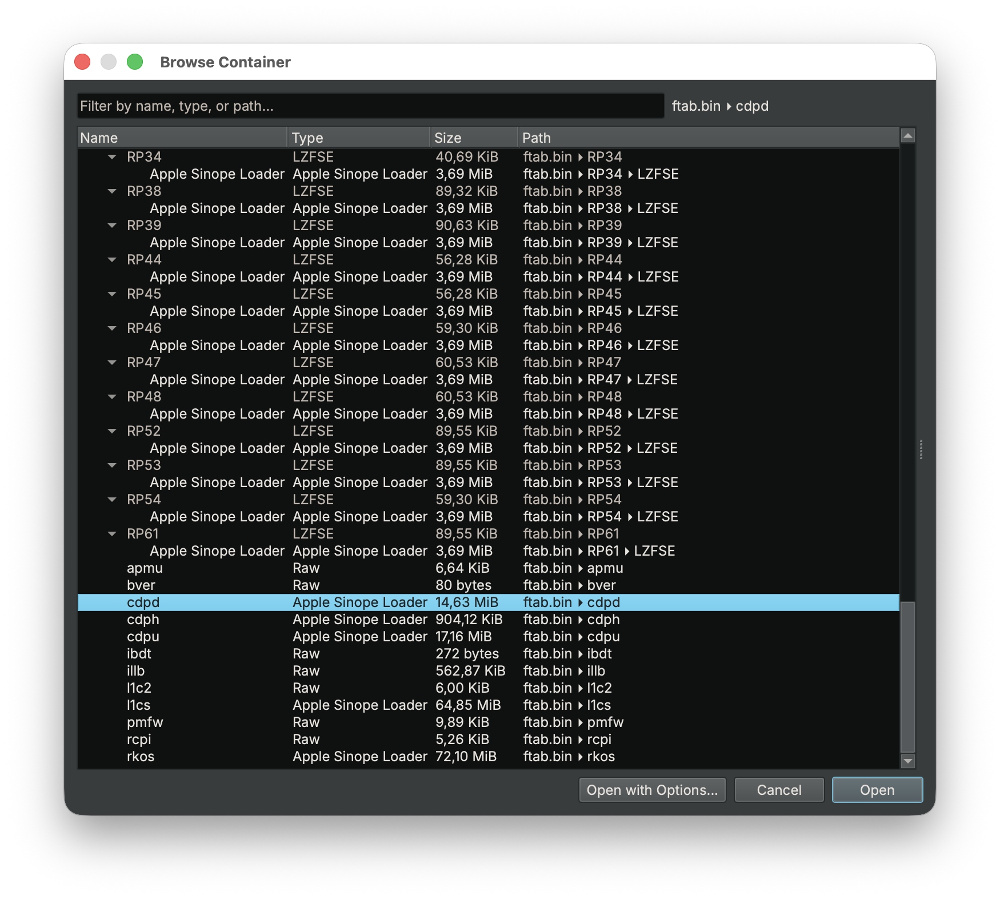

# FTAB Container Transform
Author: **Lukas Arnold**

_Provides container transforms for firmware in Apple's FTAB format._

## Description:
This plugin leverages the [Container](https://binary.ninja/2026/03/31/container-transforms.html) [Transform API](https://docs.binary.ninja/dev/containertransforms.html) to extract members from Apple's custom [firmware archive format FTAB](https://theapplewiki.com/wiki/FTAB_File_Format) directly in [Binary Ninja](https://binary.ninja/).

## License

This plugin is released under an [MIT license](./license).
